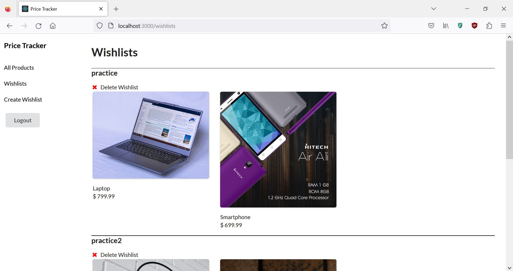

# Price Tracker
A web application that allows users to track the price history of products and add them to wishlists.

## Features
* Create an account and sign in to create wishlists and add products to them
* Search for products to look up their current prices and their pricing history

## Installation Instructions
Run the command `pipenv install` then `pipenv shell` to start the virtual environment.
Run the command  `npm install --prefix client` to download the dependencies for the frontend client. Run the command `python server/app.py` in one terminal and `npm start --prefix client` in another to start the application.

## Screenshots

## Contributing
Pull requests are welcome. For major changes, please open an issue first to discuss what you would like to change.

## License
[MIT](https://choosealicense.com/licenses/mit/)

## Sources
Product images from Wikimedia 

Database seed data generated by ChatGPT