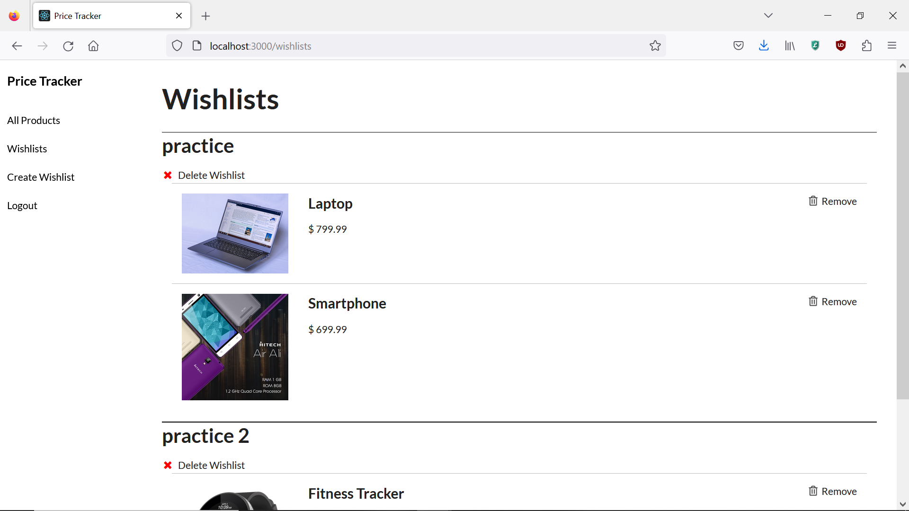

# Price Tracker
A web application that allows users to track the price history of products and add them to wishlists.

## Features
* Create an account and sign in to create wishlists and add products to them
* Search for products to look up their current prices and their pricing history

## Installation Instructions
1. Fork and clone this repository. 
2. Run the command `pipenv install` then `pipenv shell` at the root of the project directory to start the virtual environment.
3. Run the command  `npm install --prefix client` to download the dependencies for the frontend client. 
4. Create a .env file in the project root. 
5. Enter the python environment and enter `import os`. Then run the command `print(os.urandom(32))` to generate a secret key.
6. In the .env file, type `APP_SECRET_KEY = ` followed by the key you generated.
7. Run the command `python server/app.py` in one terminal and `npm start --prefix client` in another to start the application.

## Screenshots

## Files
### Back-end 
#### app.py
* Contains backend API with the following Flask-Restful routes: 
* Signup : Route to add new user information to database
* CheckSession: Checks if session has a user_id
* Login / Logout: Sets session's user_id cookie to current user's id. Deletes it on logout.
* ProductIndex : Get/Post to list of all Products
* ProductByID: Retrieve data for a single Product by its id
* WishlistIndex: Get/Post to list of all Wishlists
* WishlistProductByID: Adds or deletes a Product from a Wishlist
#### models.py
* Contains the model classes for the users, products, prices, and wishlists tables
#### config.py 
* Contains imports necessary for API and database creation, as well as for deployment. 

### Front-end
#### App.js 
* Contains code for setting up wishlists, products, and checks for session user_id. 
#### SignupForm.js / LoginForm.js
* Front-end forms which use the Formik library to validate user data on account signup or login. 
#### NavBar.js
* Sets up NavBar for user in application. Only shows "All Products", "Login" and "Sign Up" routes when logged out. Shows "All Products", "Wishlists", "Create Wishlist", and "Logout" routes when logged in. 
#### ProductPage.js / ProductCollection.js / ProductCard.js / 
* Components which set up the "All Products" page. Each individual ProductCard is a part of the ProductCollection which is displayed on the ProductPage.
#### ProductDetail.js
* Displays the detail view of an individual product. Contains the name, current price, image, and a graph of the price history of the product. Users can add the product to a wishlist by selecting one from the "Add to Wishlist" dropdown menu. 
#### ProductListing.js
* List component that is displayed on the wishlist page.
#### PricesGraph.js
* Graph component which uses the chart.js library to generate graph of a product's history of prices.
#### WishlistPage.js / WishlistCollection.js / WishlistCard.js
* Components which set up the "Wishlists" page. Each individual WishlistCard is a part of the WishlistCollection which is displayed on the WishlistPage.
#### WishlistForm.js
* Form to create a new wishlist.
#### Search.js
* Search bar on "All Products" page. 

## Contributing
Pull requests are welcome. For major changes, please open an issue first to discuss what you would like to change.

## License
[MIT](https://choosealicense.com/licenses/mit/)

## Sources
Product images from Wikimedia 

Database seed data generated by ChatGPT